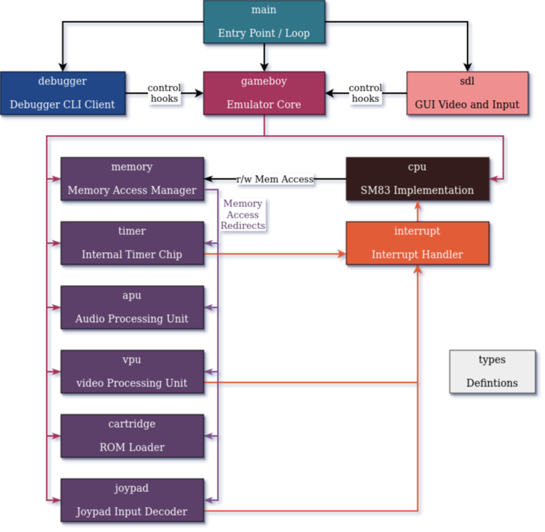

# NimBoy
A gameboy (color) emulator in NIM written as language learning excersise.

# Architecture
The gameboy is broken into modules per internal function. `gameboy.nim` 
coordinates the system level operations and issues a step for the system
by telling the CPU to execute a single operation.

The CPU returns how many system cycles it took to execute a sepcific
opcode and the gameboy then executes that many internal cycles to the 
other modules. Maybe one day I'll figure out "real" clocking but that
drastically increases the difficulty of the system.

## Memory Controller
Gameboys utilize memory-mapped IO and interfaces to other modules.
`memory.nim` serves as an interface to the CPU / other components
that abstracts away which modules to talk to. It is essentially
a proxy to other module read/write functions.

For modules that vary memory locations (such as paging ROM memory)
the modules themselves handle the pagination functions.

## Cartridge
`cartridge.nim` is responsible for loading the ROMs to execute and 
offers up some methods for reading and writing to memory within
the cartridge. Paging between different ROMs or other functions of 
the MBC are handled here.

## FAQ
**Is there anything unique about this one?**

Maybe? I tried to implment the "real" PPU pipeline which is fudged 
by many other emulators since the entire operation was not understood
at the time. See the `Ultimate Gameboy Talk` in references for more
information on how this works.

**Why another gameboy emulator?**

It's fun and I wanted a new programming challenge.

**How many games does it support?** 

None at the moment. My goal is Pokemon Blue / Red. Past that I don't know.

# References

The following are very useful for learning about the gameboy. Note that
many documents disagree with each other. It's up to you to find the 
"truth" of the Gameboy!

[https://www.youtube.com/watch?v=HyzD8pNlpwI](The _ultimate_ Gameboy Talk - Required watching!)

[https://gbdev.io/gb-opcodes/optables/](Gameboy CPU SM83 Instruction Set)

[https://gbdev.io/pandocs/](Pan Docs - "The single, most comprehensive technical reference to Game Boy available to the public.")

[https://github.com/retrio/gb-test-roms](Blargg's Gameboy Hardware Test ROMs)

[https://gekkio.fi/files/gb-docs/gbctr.pdf](Game Boy: Complete Technical Reference)

[http://marc.rawer.de/Gameboy/Docs/GBCPUman.pdf](Gameboy CPU Manual - Use with care, I've been read there are mistakes)
